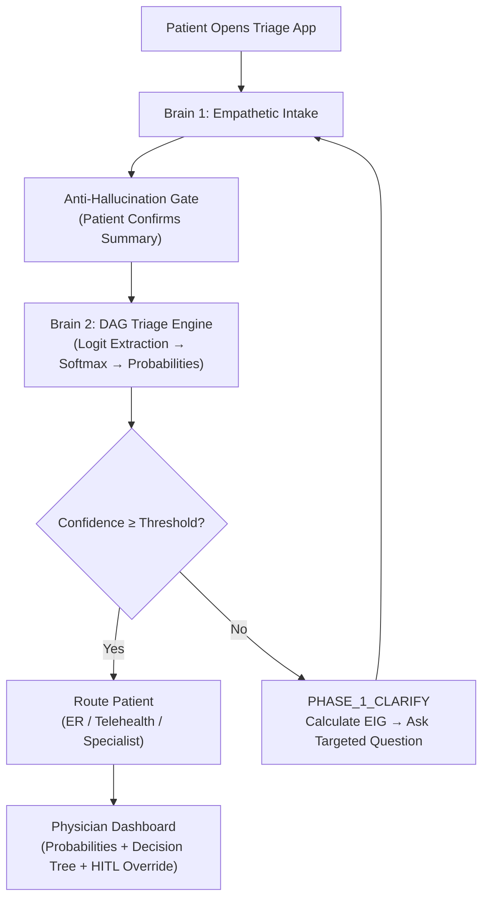

# P-ATHENA
### Precision Anamnesis Triage Handler Engine for Narrative Acquisition
**Constrained Inference & Cost-Aware Clinical Triage using MedGemma 4B**

---

## Problem Statement

The integration of generative AI into clinical triage is currently bottlenecked by critical flaws: **diagnostic hallucination**, **financial inefficiency**, and **infrastructure risks**.

Large Language Models (LLMs) are optimized for conversational verbosity. When presented with clinical vignettes, their propensity to generate sprawling differential diagnoses rather than discrete, machine-parseable conclusions renders them dangerous for autonomous downstream routing. Furthermore, standard LLMs lack inherent **Cost-Awareness** — they routinely recommend high-cost, high-friction diagnostic tests (like MRIs) before exhausting low-cost, high-value symptom inquiries.

Additionally, clinical triage is inherently **multimodal**. Forcing patients to route text symptoms and visual data (like photos of visible inflammation) through separate, cloud-based AI pipelines introduces unacceptable latency and severe data privacy (HIPAA) risks. Simultaneously, human physicians face severe time constraints that limit their ability to conduct exhaustive patient histories, compromising diagnostic accuracy.

> If we can solve the AI hallucination problem, we can automate the exhaustive, multimodal questioning phase locally. This reclaims physician time, reduces over-testing, and mitigates the malpractice liability associated with AI misdiagnosis.

---

## Solution

P-ATHENA transforms **MedGemma 1.5 4B-IT** from an unconstrained conversational agent into a **strict, probabilistic classifier with deterministic post-processing**.

To mitigate alignment-induced conversational priors and reduce generative drift during diagnosis, P-ATHENA abandons open-ended chat in the diagnostic phase. We formalize the diagnostic workflow as a **Directed Acyclic Graph (DAG)** of discrete Multiple-Choice Questions (MCQs), where each class label is mapped to a unique output token (`A`, `B`, `C`). During inference, the model's prediction is restricted to the logits corresponding to these predefined class tokens, enabling **single-pass classification** without free-form text generation.

> Transforming a conversational LLM into a high-precision classifier massively outperforms MedGemma with only generated answers in our tests.

---

## Architecture: The "Two-Brain" Loop



### The User Journey

| Phase | Description |
|-------|-------------|
| **1. Empathetic Intake** | Patient accesses the triage app. A generative conversational UI (Brain 1) gathers preliminary history with empathy and patience. |
| **2. Patient Confirmation** | The UI distills the conversation into a structured symptom summary that the patient must **explicitly confirm** — the Anti-Hallucination Gate. |
| **3. Silent Triage** | P-ATHENA's DAG engine (Brain 2) takes over. Operating entirely without generative text, MedGemma acts as a constrained inference calculator, computing calibrated probabilities. |
| **4. Dynamic Questioning** | If confidence falls below the safety threshold, the engine determines the single most statistically valuable, lowest-cost question and silently prompts Brain 1 to ask the patient — the **PHASE_1_CLARIFY loop**. |
| **5. Routing & Handoff** | Once confidence is achieved, the system routes the patient and presents the physician with a visual dashboard showing probabilities, the decision tree pathway, and a Human-in-the-Loop override mechanism. |

---

## Technical Details

### Logit Projection & Single-Pass Inference
Each class label is mapped to a distinct output token. The model's output is projected only onto the logits of these relevant class tokens. Raw logits are scaled via Temperature (T > 1) to penalize inherent LLM overconfidence:

$$P(y_i | x) = \frac{\exp(z_i / T)}{\sum_{j} \exp(z_j / T)}$$

### The PHASE_1_CLARIFY Loop
When Brain 2's confidence falls below the safety threshold, it triggers a `PHASE_1_CLARIFY` state. It calculates the highest-value question via Expected Information Gain (EIG) and instructs Brain 1 to ask the patient, creating a continuous feedback loop until diagnostic certainty is reached.

### Cost-Utility Routing (EIG)
When confidence is low, the engine calculates the expected reduction in Shannon Entropy against the financial cost of candidate tests:

$$EIG = H(S_{current}) - \mathbb{E}[H(S_{next})]$$
$$\omega = \frac{EIG}{\ln(\text{cost} + e)}$$

This mathematically guarantees that expensive procedures are only recommended when low-cost symptom queries have been exhausted.

### Anti-Hallucination Gate
Before data enters the triage DAG, Brain 1 distills the generative conversation into a structured summary that the patient must verify. MedGemma only computes probabilities on **patient-confirmed facts**.

### Constrained Inference & Regex-Gating
Determinism is enforced at the output parsing layer via Greedy Decoding (`do_sample=False`), a physical token limit (`max_new_tokens=10`), and strict XML schema wrapping. A post-processing Regex parser acts as a "Safety Circuit Breaker."

### Edge Deployment
Single-pass classification on the lightweight 4B architecture enables offline deployment on standard hospital hardware (4-bit quantized weights), ensuring HIPAA compliance.

---

## Project Structure

```
MedGemma/
├── app.py              # Streamlit dashboard (Patient Intake + Doctor Dashboard)
├── config.py           # Environment variables & safety constants
├── gatherer.py         # Brain 1: Empathetic patient intake + EIG loop
├── llm_engine.py       # Brain 2: Single-pass logit extraction & softmax
├── tree_core.py        # DAG engine: DecisionNode, ClinicalTree, EIG, entropy
├── pathways.py         # Clinical pathway schemas (Cough, Headache, Chest Pain)
├── brain_loader.py     # MedGemma model loader with GPU/CPU fallback
├── test_pathways.py    # End-to-end DAG test suite (3 scenarios, mock LLM)
├── test_console.py     # Console-based testing utility
├── requirements.txt    # Python dependencies
└── .gitignore
```

---

## Supported Triage Protocols

| Protocol | DAG Nodes | Terminal Diagnoses |
|----------|-----------|-------------------|
| **Respiratory (Cough)** | Red flag screen → Duration → Etiology | Post-infectious, Pertussis, Chronic Cough, Pneumonia workup |
| **Headache** | Red flag screen → Characterization | Migraine, Tension-Type, Cluster |
| **Chest Pain** | Red flag screen → Pain character → Risk factors → Biomarkers | GERD, Cardiac workup (ECG + Troponin) |

---

## Installation & Setup

### Prerequisites
- Python 3.10+
- NVIDIA GPU with CUDA 12.x (optional — CPU fallback available)
- [Hugging Face](https://huggingface.co/) account with access to [google/medgemma-1.5-4b-it](https://huggingface.co/google/medgemma-1.5-4b-it)

### 1. Clone the Repository

```bash
git clone https://github.com/boppwolfram-sudo/MedGemma.git
cd MedGemma
```

### 2. Create Virtual Environment

```bash
python -m venv venv

# Windows
.\venv\Scripts\activate

# Linux/Mac
source venv/bin/activate
```

### 3. Install Dependencies

```bash
pip install -r requirements.txt
```

For GPU support, install PyTorch with CUDA:
```bash
pip install torch --index-url https://download.pytorch.org/whl/cu126
```

### 4. Set Your Hugging Face Token

The token is required to download MedGemma weights. Set it as an environment variable:

```bash
# Windows (PowerShell)
$env:HF_TOKEN = "hf_YOUR_TOKEN_HERE"

# Linux/Mac
export HF_TOKEN="hf_YOUR_TOKEN_HERE"
```

### 5. Run the Application

```bash
streamlit run app.py
```

The dashboard will open at `http://localhost:8501`.

### 6. Run Tests (No GPU Required)

```bash
python test_pathways.py
```

This runs 3 end-to-end clinical scenarios using a mock LLM to verify all DAG traversal, PHASE_1_CLARIFY loops, and terminal diagnoses.

### Mock Mode (No GPU / No Model)

To run the UI without loading MedGemma (for frontend development or demos), set `USE_MOCK_INFERENCE = True` in `config.py`. The system will use simulated probability distributions.

---

## Outlook

Due to late participation in this competition, we focused on handling the core problem: **hallucination**. We implemented an evaluation engine to analyse different clinical cases and data. Additionally, we provided a first POC with Streamlit — with still a lot of work ahead.

Future work includes:
- **MedSigLIP Integration**: Visual encoding for patient-uploaded imagery within the deterministic triage pipeline
- **Expanded Pathway Registry**: Additional clinical protocols (Fever, Back Pain, Shortness of Breath, Abdominal Pain)
- **Calibration Validation**: Platt scaling against epidemiological data for production-grade thresholds
- **Clinician Feedback Loop**: HITL override mechanism for continuous model calibration
- **Population Bias Auditing**: Demographic representativeness validation
- **Model upgrade**: Switching google/medgemma-1.5-4b-it used for POC with 27b version for further increase in accuarcy.

---

## License

This project was developed for the [Google MedGemma Competition](https://www.kaggle.com/competitions/medgemma).
